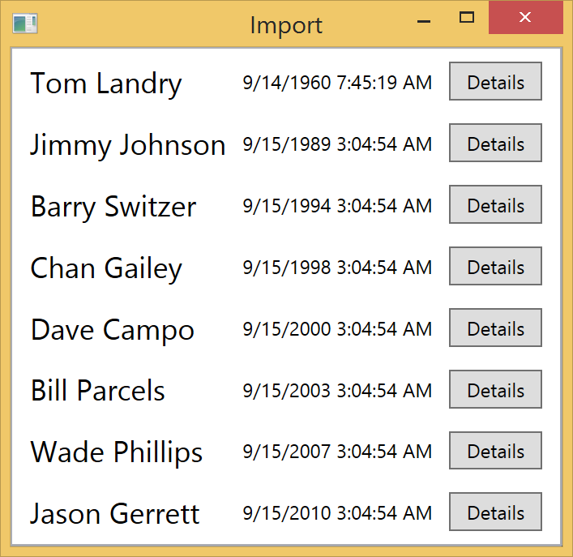
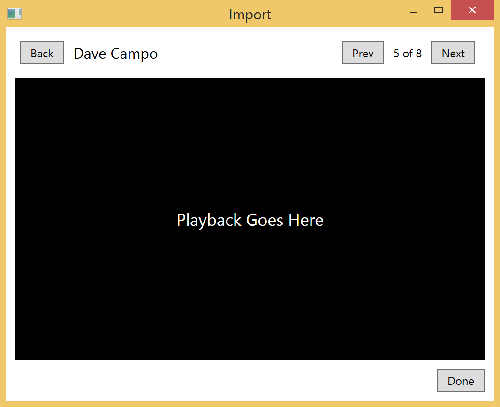

PoC.ImportList
==============

Proof of concept for using Caliburn view contexts to support different views over the same data





Shell
-----

Contains only a content control that points to the active item: `ImportList`. There's also an attached property that ties the view's context to the `ViewContext` property on `ImportListViewModel`.

```XML
<ContentControl x:Name="ActiveItem" cal:View.Context="{Binding ActiveItem.ViewContext}"/>
```


Import
------

Import exists in two contexts: List and Details. I've represented that as an enum stored on the `ImportViewModel`.

We start in the List context.

```C#
public class ImportViewModel : ReactiveConductor<RecordedEventViewModel>.Collection.OneActive
{
    public ImportViewModel()
    {
        ViewContext = ViewContext.List;
    }
}
```

Whenever we want to switch contexts we simply change the value of this property

```C#
public void Details(RecordedEventViewModel model)
{
    ActivateItem(model);
    ViewContext = ViewContext.Details;
}

public void List()
{
    ViewContext = ViewContext.List;
}
```

__Note:__ I'm using Caliburn's action message system to bubble the Details action up.

There's a folder called 'Import' which contains two views named after the values of the enum: `List.xaml` and `Details.xaml`.

When the context property is changed Caliburn will swap the views out while leaving the view model alone.


Other
-----

__RecordedEventView.xaml__ Represents an item in the list.

__RecordedEventViewModel.cs__ Represents a recorded event used by the list in the collection and the details as the active item.
